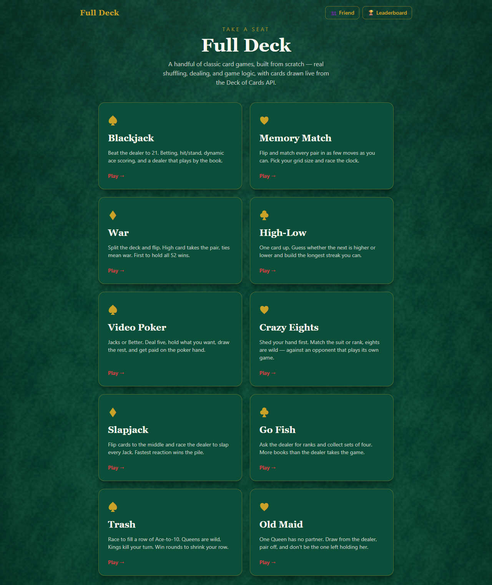
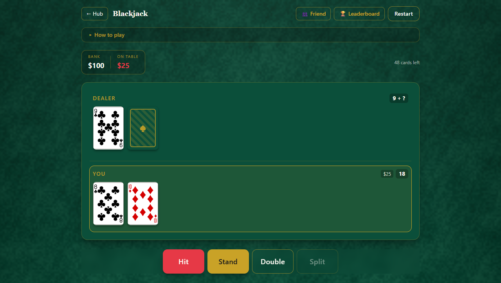
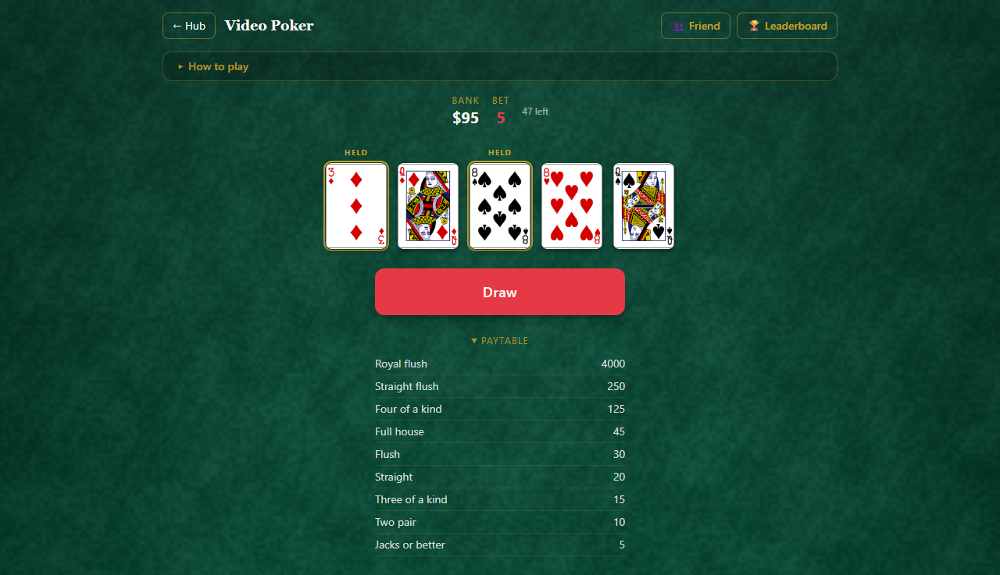

# Full Deck

A small collection of classic card games built from scratch — the point isn't
displaying card data, it's implementing the actual games: shuffling, dealing,
hand scoring, dealer AI, win conditions, and the discrete state transitions each
game runs on. Nine games — Blackjack, Memory Match, War, High-Low, Video Poker,
Crazy Eights, Slapjack, Go Fish, and Trash — share one foundation, and the
interesting logic is factored into isolated pure functions with their own unit
tests rather than tangled into components. Rules follow the Bicycle / Wikipedia
references, and each game screen carries a matching "How to play" panel.

**Live demo:** [full-deck-five.vercel.app](https://full-deck-five.vercel.app)







## What it does

**Blackjack.** Bet from a chip stack, get dealt two cards against a dealer
showing one, then hit / stand / **double down** / **split** a pair (up to four
hands, each with its own bet). If the dealer shows an ace you're offered
**insurance**. Aces score as 1 or 11 dynamically, the dealer plays to 17 (S17),
and each hand settles to win / loss / push / blackjack — 3:2 on a natural. Run
out of chips and you can reset.

**Memory Match.** A grid of face-down cards — 4×4 or 6×6 — flipped two at a time.
Matches stay up with a brief pulse; a mismatch locks the board for a beat so you
can't click a third card mid-comparison, then flips back. Move counter and timer
run throughout, and clearing every pair shows a completion screen with your
moves and time.

**War.** The deck is split 26/26 and you flip a card each per battle — higher
rank takes the pair. A tie means **war**: three cards face down and one face up
per side, higher up-card sweeps the table (repeats on another tie). Won cards are
shuffled back in so games terminate; the match ends when a player holds all 52.

**High-Low.** One card face-up; call whether the next is higher or lower and
build a streak. Aces are high, equal ranks are a push. Best streak for the
session is tracked.

**Video Poker (Jacks or Better).** Bet 1–5 credits, get five cards, hold any of
them, and draw replacements for the rest. The resulting five-card poker hand is
evaluated and paid on a 9/6 schedule — right down to the max-bet royal-flush
bonus.

**Crazy Eights.** Heads-up against an AI. Deal seven each; play a card matching
the discard's suit or rank, or an eight (wild — you name the new suit). No legal
card means you draw until you get one (Bicycle rule); pass only when the deck is
truly dead. First to shed their hand wins.

**Slapjack.** The deck is split 26/26 and you alternate flipping to a centre
pile. When a Jack lands, race the dealer to **slap** — the slapper takes the
pile; a false slap forfeits a card. Collect all 52 to win.

**Go Fish.** Deal seven each, rest to the stock. Ask the dealer for a rank you
hold: a hit hands over every match and you ask again; a miss is "go fish". Book
sets of four; most books when all 13 are made wins.

**Trash (Garbage).** Fill a face-down row with Ace → 10 in order. Draw, slot the
card into its position, swap up whatever was there and keep going. Queens are
wild, Jacks and Kings end the turn. Clear the row to win the round; the winner
lays one fewer card next round — win a round at one card to take the match.

Every game draws a real, server-shuffled deck from the free, keyless
[Deck of Cards API](https://deckofcardsapi.com/) rather than simulating a deck
in memory, and render card fronts straight from the API's image URLs (the
[vector-playing-cards](https://code.google.com/archive/p/vector-playing-cards/)
set it serves), with a CSS-drawn fallback if an image fails to load.

**Leaderboard.** Each game reports one headline number to a shared, cross-visitor
leaderboard in the top nav — peak bank (Blackjack), best 6×6 time (Memory),
longest streak (High-Low), fewest battles (War), biggest single win (Video
Poker), cards left on the AI (Crazy Eights), fastest slap (Slapjack), books
collected (Go Fish), turns to the match win (Trash). Backed by a Neon Postgres
table behind a Vercel serverless function, with an
[`obscenity`](https://github.com/jo3-l/obscenity)-based name filter (leetspeak,
spacing, and confusable-unicode aware, with a false-positive whitelist).
Client-side pre-check, server-side authority; the app still runs with no database
attached (the API answers 503 and the UI says so).

**Multiplayer.** "👥 Friend" in the nav → host a room (a 6-character code from an
unambiguous alphabet) or join one; two players, same link. The authoritative
game state is a `rooms` row; the *same reducers* run inside the serverless
function, which validates that the acting seat owns the move before applying it.
Clients stay live by long-polling — a `GET` that hangs server-side up to ~24s and
returns the instant the room's `version` bumps. War, Slapjack, Old Maid, Crazy
Eights, Go Fish, and Trash are all playable in a room (High-Low and Video Poker
stay solo). Solo-vs-AI is untouched — the reducers were generalised so each move
carries an optional `side`, the AI move-picker just dispatches side `'ai'`, and a
human in that seat sends the same actions.

## Notable engineering decisions

The parts worth reading are the pure functions — each is isolated, unit-tested,
and free of any React or network concerns.

- **Ace-aware hand scoring** ([`src/games/blackjack/handScoring.ts`](src/games/blackjack/handScoring.ts)).
  Every ace starts at 11; while the total is over 21 *and* an ace is still
  counted high, one ace is demoted to 1 and the check repeats. Whatever aces
  remain high make the hand *soft*, which the UI uses to show dual totals
  (`7 / 17`). This is the classic tricky bit of Blackjack, so it lives on its
  own with tests for multi-ace hands, forced demotion, and 3-card-21 ≠ natural.

- **Dealer AI as a pure, injectable function**
  ([`src/games/blackjack/dealerAI.ts`](src/games/blackjack/dealerAI.ts)).
  `dealerShouldHit(hand)` is a pure function of the hand — hit under 17, stand on
  17+ including soft 17 (an S17 table). `playDealerHand(hand, drawOne)` runs the
  whole turn, taking cards from an injected `drawOne` callback, so the rule is
  testable with a stubbed deck and the React layer supplies a `drawOne` that
  pulls from the live API with a delay between cards for feel.

- **The match-lock state machine**
  ([`src/games/memory/memoryReducer.ts`](src/games/memory/memoryReducer.ts)).
  On a mismatch the reducer sets `lock: true` and leaves both cards showing;
  `FLIP` is a no-op while locked, so a third click during the "look at it" beat
  is ignored. A timed `RESOLVE` action clears the pair. Small detail, but it's
  the kind of state-management bug that's obvious once it bites.

- **A reusable poker-hand evaluator**
  ([`src/games/videopoker/pokerHand.ts`](src/games/videopoker/pokerHand.ts)).
  `evaluateHand(cards)` reduces five cards to a category with an ordered set of
  checks — flush and straight flags plus rank-multiplicity shape — handling both
  the ace-high straight and the A-2-3-4-5 wheel, and distinguishing a low pair
  from a paying pair of jacks. The paytable
  ([`paytable.ts`](src/games/videopoker/paytable.ts)) is a separate lookup so
  the scoring and the economics stay independent.

- **Blackjack is a multi-hand state machine**
  ([`src/games/blackjack/blackjackReducer.ts`](src/games/blackjack/blackjackReducer.ts)).
  State is an array of hands with a per-hand bet and an active-hand pointer;
  `split` inserts two hands in place, `double` doubles one and auto-stands, and
  an `insurance` phase peeks the dealer before play. `settle()` takes a
  `playerNatural` flag so a two-card 21 formed by splitting pays 1:1, not 3:2.

- **War is made to terminate.** The real Bicycle rule — three cards face down,
  one face up, higher up-card sweeps — but the pot is shuffled before it folds
  into the winner's pile
  ([`src/games/war/warReducer.ts`](src/games/war/warReducer.ts)), because classic
  War with fixed card ordering can otherwise loop forever.

- **Trash keeps the whole deck in reducer state.**
  ([`src/games/trash/`](src/games/trash/)) so the placement chain (slot a card,
  swap up the one underneath, play *that*, …), wilds, dead cards, the
  round ladder (10 → 9 → … → 1), and the match win are all pure and testable —
  no async draws mid-turn. `placementFor(card, size)` is the small function that
  decides slot / wild / dead.

- **A real profanity filter, not a wordlist grep.**
  [`src/lib/profanity.ts`](src/lib/profanity.ts) wraps `obscenity`'s matcher with
  leetspeak / confusable / repeated-character / separator transformers plus a
  slur supplement, and its English whitelist keeps "assassin", "class", and
  "Scunthorpe" clean. Shared by the client (instant feedback) and
  [`api/scores.ts`](api/scores.ts) (the authority).

- **Crazy Eights turn machine + AI**
  ([`src/games/crazyeights/`](src/games/crazyeights/)). Legality
  (`isPlayable`: eight, or suit, or rank — against the *active* suit, which an
  eight can change) and the opponent's policy (`chooseAiPlay`: play a matching
  non-eight, save eights, otherwise play an eight naming your strongest suit) are
  pure. The reducer runs `playerTurn → awaitSuit → aiTurn → …` and the AI plays
  one `AI_STEP` at a time on a timer, so drawing several cards before a play is
  visible rather than instant. Guarantees against a stuck game: the stock
  recycles from the discard pile, and a player with no move and nothing to draw
  passes.

- **Reducers stay pure; the container owns the network.** Every game is a
  `useReducer` state machine (`DEAL`, `HIT`, `STAND`, `FLIP`, `ASK`, `AI_STEP`,
  …). API calls happen in the container and drawn cards are passed *into* actions
  as payloads, so no reducer ever awaits anything and every one is directly
  unit-testable. Games where the whole deck is dealt up front (Go Fish, Trash)
  keep the stock in reducer state and are fully deterministic.

- **The AI opponents are pure policies.** Crazy Eights (`chooseAiPlay`), Go Fish
  (`chooseAiAsk`, with a small memory of what you've asked for), Trash (fill the
  lowest open slot), and Slapjack (a randomised reaction delay) — each decides in
  a plain function the container steps on a timer so the moves are watchable.

- **`useDeck`** ([`src/hooks/useDeck.ts`](src/hooks/useDeck.ts)) caches the deck
  id for the session, auto-reshuffles when the deck runs low (repeated Blackjack
  hands eventually dry a single deck), and exposes stable method identities so
  effects that depend on it don't re-fire on every render.

- **The dealer-turn effect is hardened against React 19 StrictMode.** Its async
  loop tracks both `cancelled` and `completed`; an aborted run (the double-invoke
  in dev) resets its guard so the turn restarts instead of hanging half-drawn.

- **Card flip is transform-only.** A `preserve-3d` wrapper with two
  `backface-hidden` faces and a `rotateY(180deg)` toggle — no layout shift, so it
  stays smooth on mobile.

- **One config module drives the leaderboard on both sides.**
  [`src/lib/leaderboard.ts`](src/lib/leaderboard.ts) — the game list, each
  metric's ranking direction, validation bounds, name sanitising, score
  formatting — is imported by the React app *and* the
  [`api/scores.ts`](api/scores.ts) serverless function, so a new game or a
  changed bound is one edit. The API validates every POST against it and orders
  each board `ASC`/`DESC` from `higherIsBetter`. `getDb()`
  ([`db/client.ts`](db/client.ts)) throws when `DATABASE_URL` is unset and the
  route turns that into a 503 — the whole app works with no database attached.

- **166 unit tests** ([Vitest](https://vitest.dev/)) over scoring, dealer AI,
  outcome settlement, board building, card comparison, high-low judging, poker
  evaluation, payouts, blackjack split/double/insurance, war conservation, every
  AI policy, the profanity filter, leaderboard validation/formatting, and every
  reducer transition. They need no network and no DOM.

## Tech stack

| Layer | Choice |
| --- | --- |
| Framework | React 19 + TypeScript (strict) |
| Build | Vite |
| Styling | Tailwind CSS v4 (palette defined in `@theme`) |
| Routing | React Router — `/`, nine game routes, `/leaderboard` |
| State | `useReducer` per game; `useDeck` custom hook for the shared deck |
| Tests | Vitest (pure-logic unit tests) |
| Card data | Deck of Cards API (free, no key) |
| Leaderboard + rooms | Vercel serverless functions (`api/`) + Neon Postgres via Drizzle ORM; `obscenity` name filter; long-poll sync |
| Hosting | Vercel (static SPA + functions) |

## Local setup

```bash
npm install      # .npmrc pins legacy-peer-deps — npm 11 crashes on vitest's optional-peer graph
npm run dev      # http://localhost:5173  (games work; /api is not served here)
npm test         # game-logic + leaderboard unit tests (offline)
npm run build    # tsc typecheck (app + api) + production build
npm run lint
```

The leaderboard needs the serverless function, which plain `vite` doesn't run.
To exercise it locally, put a Postgres URL in `.env.local`
(`cp .env.example .env.local`), run `npm run db:push` once, then `vercel dev`.
Without it the games all work and the leaderboard shows "not available here".

## Deployment

App → Vercel, framework preset **Vite**. Files in [`api/`](api/) deploy as
serverless functions; [`vercel.json`](vercel.json) rewrites every non-`/api`
path to `index.html` so the client router handles the routes on a hard refresh.
The repo is connected to Vercel, so a push to `master` is a production deploy.

**Database.** The live demo is wired to a Neon Postgres store (created from the
Vercel project's **Storage** tab, which sets `DATABASE_URL`); `npm run db:push`
created the `scores` and `rooms` tables. To run your own, do the same and set
`DATABASE_URL` for all environments. Until that's done the site still deploys and
runs — the leaderboard and multiplayer just report that they aren't configured.

## What's next

Things worth adding if this grew past a portfolio piece:

- Heads-up Texas Hold'em — the poker evaluator already does most of the work.
- Leaderboard hardening — a bot deterrent beyond the per-instance rate limit,
  and server-side plausibility checks tighter than the current range bounds.
- Component/interaction tests — the logic is covered, but the assembled UI
  currently leans on `tsc`, `vite build`, and headless-Chromium screenshots.
- Sound and haptics on deal / flip / win.
